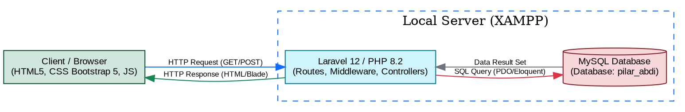
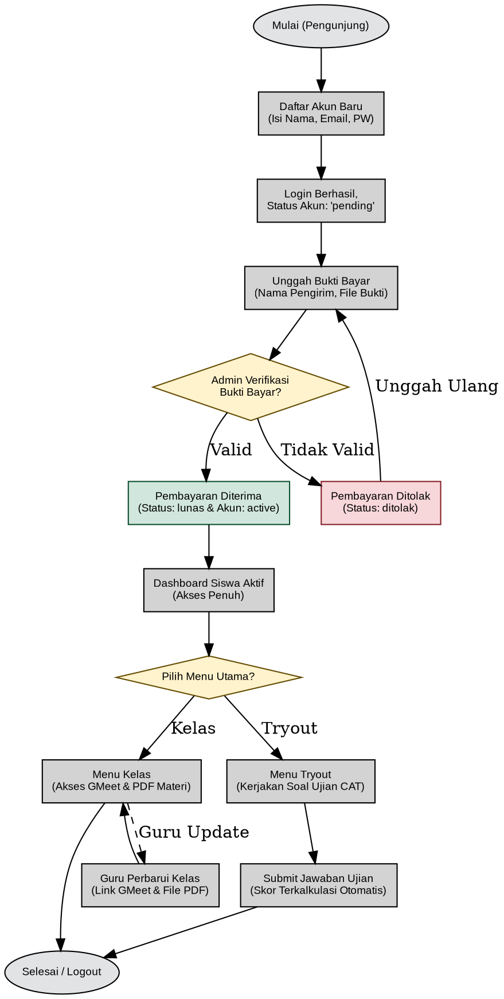
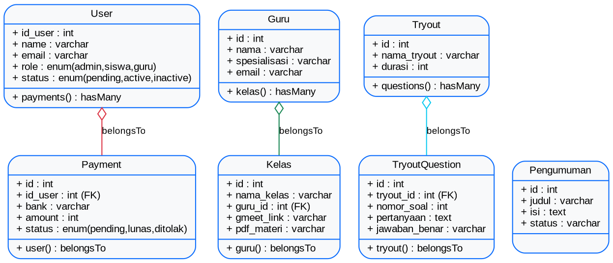

# BAB 3 PERANCANGAN SISTEM

## 3.1 Arsitektur Sistem
Aplikasi web **Pilar Abdi** dirancang menggunakan arsitektur 3-tier standar yang memisahkan antara presentasi, logika aplikasi, dan penyimpanan data. Tiga komponen utamanya adalah:
1. **Frontend (Presentation Layer)**: Berjalan di sisi client (browser pengguna) menggunakan teknologi HTML5, CSS3 (Bootstrap 5), dan JavaScript untuk merender halaman antarmuka dinamis.
2. **Backend (Application Logic Layer)**: Berjalan di sisi server menggunakan framework Laravel 12 (PHP 8.2) untuk mengolah logika bisnis, perutean (*routing*), pengontrol (*controllers*), dan pengamanan akses via middleware.
3. **Database (Data Storage Layer)**: Menyimpan seluruh data relasional menggunakan DBMS MySQL yang dijalankan secara lokal melalui modul XAMPP.

Berikut adalah diagram arsitektur sistem yang digambarkan menggunakan kode **Graphviz**:

### Narasi Aliran Data
1. Pengguna berinteraksi dengan **Frontend** di browser dan mengirimkan permintaan (misalnya, mengisi form login). Browser mengirimkan *HTTP POST Request* ke server lokal.
2. Di **Backend**, request tersebut ditangkap oleh routing Laravel, divalidasi keamanannya oleh **Middleware** (untuk memeriksa hak akses), dan diproses oleh **Controller**.
3. Jika data perlu diverifikasi atau diambil dari database, Controller memanggil model Eloquent yang mengirimkan *SQL Query* ke **Database MySQL**.
4. Database memproses data dan mengirimkan kembali *Data Result Set* ke Controller.
5. Controller memformat data tersebut ke dalam bentuk tampilan Blade template (HTML) lalu mengirimkannya kembali ke Browser sebagai *HTTP Response* untuk ditampilkan ke pengguna.

---

## 3.2 Workflow Sistem
Workflow sistem menggambarkan langkah-langkah penggunaan aplikasi dari awal pendaftaran siswa, verifikasi admin, hingga pelaksanaan kelas dan tryout.

Berikut adalah diagram alir (*flowchart*) workflow sistem menggunakan kode **Graphviz**:

### Narasi Alur Kerja (Workflow)
1. **Pendaftaran**: Pengunjung mendaftar akun baru dengan mengisi formulir registrasi. Akun yang terbuat berstatus `pending` sehingga membatasi siswa agar tidak bisa mengakses fitur kelas maupun tryout terlebih dahulu.
2. **Unggah Pembayaran**: Siswa melakukan transfer pembayaran secara manual dan mengunggah informasi transfer beserta bukti gambar di halaman Pembayaran.
3. **Persetujuan Admin (Decision)**: Admin memverifikasi bukti tersebut. Jika tidak valid/nominal salah, status diubah menjadi `ditolak` dan siswa diminta mengunggah ulang. Jika valid, status diubah menjadi `lunas` dan status user berubah menjadi `active`.
4. **Akses Fitur Siswa**: Siswa aktif masuk ke dashboard dan dapat mengakses dua menu utama:
   * **Kelas**: Siswa dapat mengakses ruang pertemuan Google Meet untuk pembelajaran kelas online secara daring dan mengunduh PDF materi yang telah diunggah oleh **Guru**.
   * **Tryout**: Siswa dapat memilih tryout yang sedang aktif, menjawab soal satu per satu, dan melakukan pengiriman (*submit*) jawaban yang langsung dikalkulasi skornya oleh sistem.

---

## 3.3 Class Diagram
Struktur kode program Laravel di direktori `app/` terdiri atas Models yang mewakili entitas database, Controllers yang mengelola logika alur data, dan Middleware yang memfilter hak akses.

Berikut adalah visualisasi hubungan antar-kelas (Class Diagram) dalam sistem:

### Kode DOT Source

### Penjelasan Relasi Kelas
1. **User & Payment**: Hubungan *One-to-Many* (Satu user dapat memiliki banyak riwayat transaksi pembayaran). Kelas `Payment` memiliki foreign key `id_user` yang merujuk ke tabel `User`.
2. **Guru & Kelas**: Hubungan *One-to-Many* (Satu guru pengampu dapat mengajar di banyak kelas). Kelas `Kelas` memiliki foreign key `guru_id` yang merujuk ke model `Guru`.
3. **Tryout & TryoutQuestion**: Hubungan *One-to-Many* (Satu tryout memiliki banyak soal pertanyaan di dalamnya). Kelas `TryoutQuestion` memiliki foreign key `tryout_id` yang merujuk ke model `Tryout`.

---

## 3.4 Entity Relationship Diagram (ERD)
Perancangan skema basis data MySQL `pilar_abdi` memetakan struktur tabel beserta relasi kardinalitas antartabel.

Berikut adalah visualisasi skema basis data (Entity Relationship Diagram) dalam sistem:

### Kode DOT Source

```dot
digraph ERDBasisDataPilarAbdi {
    fontname="Arial";
    fontsize=11;
    rankdir=LR;
    
    // Seting khusus desain kotak ERD (Warna Merah/Pink Database)
    node [shape=plaintext, fontname="Arial", fontsize=10];
    edge [fontname="Arial", fontsize=9, color="#dc3545"];
    
    users [label=<
        <TABLE BORDER="0" CELLBORDER="1" CELLSPACING="0" CELLPADDING="4" BGCOLOR="#fbf1f2" COLOR="#dc3545">
            <TR><TD COLSPAN="2" BGCOLOR="#dc3545"><FONT COLOR="white"><B>users</B></FONT></TD></TR>
            <TR><TD PORT="pk" ALIGN="LEFT"><B>id_user (PK)</B></TD></TR>
            <TR><TD ALIGN="LEFT">name (varchar)</TD></TR>
            <TR><TD ALIGN="LEFT">email (varchar)</TD></TR>
            <TR><TD ALIGN="LEFT">whatsapp (varchar)</TD></TR>
            <TR><TD ALIGN="LEFT">password (varchar)</TD></TR>
            <TR><TD ALIGN="LEFT">role (varchar)</TD></TR>
            <TR><TD ALIGN="LEFT">status (varchar)</TD></TR>
            <TR><TD ALIGN="LEFT">package (varchar)</TD></TR>
            <TR><TD ALIGN="LEFT">sekdin (varchar)</TD></TR>
            <TR><TD ALIGN="LEFT">address (text)</TD></TR>
        </TABLE>
    >];

    pembayaran [label=<
        <TABLE BORDER="0" CELLBORDER="1" CELLSPACING="0" CELLPADDING="4" BGCOLOR="#fbf1f2" COLOR="#dc3545">
            <TR><TD COLSPAN="2" BGCOLOR="#dc3545"><FONT COLOR="white"><B>pembayaran</B></FONT></TD></TR>
            <TR><TD PORT="pk" ALIGN="LEFT"><B>id (PK)</B></TD></TR>
            <TR><TD PORT="fk" ALIGN="LEFT">id_user (FK)</TD></TR>
            <TR><TD ALIGN="LEFT">bank (varchar)</TD></TR>
            <TR><TD ALIGN="LEFT">account_number (varchar)</TD></TR>
            <TR><TD ALIGN="LEFT">sender_name (varchar)</TD></TR>
            <TR><TD ALIGN="LEFT">transfer_date (date)</TD></TR>
            <TR><TD ALIGN="LEFT">transfer_time (time)</TD></TR>
            <TR><TD ALIGN="LEFT">amount (bigint)</TD></TR>
            <TR><TD ALIGN="LEFT">proof_path (varchar)</TD></TR>
            <TR><TD ALIGN="LEFT">status (enum)</TD></TR>
        </TABLE>
    >];

    gurus [label=<
        <TABLE BORDER="0" CELLBORDER="1" CELLSPACING="0" CELLPADDING="4" BGCOLOR="#fbf1f2" COLOR="#dc3545">
            <TR><TD COLSPAN="2" BGCOLOR="#dc3545"><FONT COLOR="white"><B>gurus</B></FONT></TD></TR>
            <TR><TD PORT="pk" ALIGN="LEFT"><B>id (PK)</B></TD></TR>
            <TR><TD ALIGN="LEFT">nama (varchar)</TD></TR>
            <TR><TD ALIGN="LEFT">spesialisasi (varchar)</TD></TR>
            <TR><TD ALIGN="LEFT">whatsapp (varchar)</TD></TR>
            <TR><TD ALIGN="LEFT">email (varchar)</TD></TR>
            <TR><TD ALIGN="LEFT">password (varchar)</TD></TR>
            <TR><TD ALIGN="LEFT">bio (text)</TD></TR>
        </TABLE>
    >];

    kelas [label=<
        <TABLE BORDER="0" CELLBORDER="1" CELLSPACING="0" CELLPADDING="4" BGCOLOR="#fbf1f2" COLOR="#dc3545">
            <TR><TD COLSPAN="2" BGCOLOR="#dc3545"><FONT COLOR="white"><B>kelas</B></FONT></TD></TR>
            <TR><TD PORT="pk" ALIGN="LEFT"><B>id (PK)</B></TD></TR>
            <TR><TD ALIGN="LEFT">nama_kelas (varchar)</TD></TR>
            <TR><TD ALIGN="LEFT">materi (varchar)</TD></TR>
            <TR><TD PORT="fk" ALIGN="LEFT">guru_id (FK)</TD></TR>
            <TR><TD ALIGN="LEFT">hari (varchar)</TD></TR>
            <TR><TD ALIGN="LEFT">jam (varchar)</TD></TR>
            <TR><TD ALIGN="LEFT">gmeet_link (varchar)</TD></TR>
            <TR><TD ALIGN="LEFT">pdf_materi (varchar)</TD></TR>
            <TR><TD ALIGN="LEFT">deskripsi (text)</TD></TR>
        </TABLE>
    >];

    tryouts [label=<
        <TABLE BORDER="0" CELLBORDER="1" CELLSPACING="0" CELLPADDING="4" BGCOLOR="#fbf1f2" COLOR="#dc3545">
            <TR><TD COLSPAN="2" BGCOLOR="#dc3545"><FONT COLOR="white"><B>tryouts</B></FONT></TD></TR>
            <TR><TD PORT="pk" ALIGN="LEFT"><B>id (PK)</B></TD></TR>
            <TR><TD ALIGN="LEFT">nama_tryout (varchar)</TD></TR>
            <TR><TD ALIGN="LEFT">deskripsi (text)</TD></TR>
            <TR><TD ALIGN="LEFT">jumlah_soal (int)</TD></TR>
            <TR><TD ALIGN="LEFT">durasi (int)</TD></TR>
            <TR><TD ALIGN="LEFT">tanggal_mulai (datetime)</TD></TR>
            <TR><TD ALIGN="LEFT">tanggal_berakhir (datetime)</TD></TR>
            <TR><TD ALIGN="LEFT">status (enum)</TD></TR>
        </TABLE>
    >];

    tryout_questions [label=<
        <TABLE BORDER="0" CELLBORDER="1" CELLSPACING="0" CELLPADDING="4" BGCOLOR="#fbf1f2" COLOR="#dc3545">
            <TR><TD COLSPAN="2" BGCOLOR="#dc3545"><FONT COLOR="white"><B>tryout_questions</B></FONT></TD></TR>
            <TR><TD PORT="pk" ALIGN="LEFT"><B>id (PK)</B></TD></TR>
            <TR><TD PORT="fk" ALIGN="LEFT">tryout_id (FK)</TD></TR>
            <TR><TD ALIGN="LEFT">nomor_soal (int)</TD></TR>
            <TR><TD ALIGN="LEFT">kategori (enum)</TD></TR>
            <TR><TD ALIGN="LEFT">pertanyaan (text)</TD></TR>
            <TR><TD ALIGN="LEFT">pilihan_a (text)</TD></TR>
            <TR><TD ALIGN="LEFT">pilihan_b (text)</TD></TR>
            <TR><TD ALIGN="LEFT">pilihan_c (text)</TD></TR>
            <TR><TD ALIGN="LEFT">pilihan_d (text)</TD></TR>
            <TR><TD ALIGN="LEFT">pilihan_e (text)</TD></TR>
            <TR><TD ALIGN="LEFT">jawaban_benar (char)</TD></TR>
            <TR><TD ALIGN="LEFT">pembahasan (text)</TD></TR>
        </TABLE>
    >];

    pengumuman [label=<
        <TABLE BORDER="0" CELLBORDER="1" CELLSPACING="0" CELLPADDING="4" BGCOLOR="#fbf1f2" COLOR="#dc3545">
            <TR><TD COLSPAN="2" BGCOLOR="#dc3545"><FONT COLOR="white"><B>pengumuman</B></FONT></TD></TR>
            <TR><TD PORT="pk" ALIGN="LEFT"><B>id (PK)</B></TD></TR>
            <TR><TD ALIGN="LEFT">judul (varchar)</TD></TR>
            <TR><TD ALIGN="LEFT">isi (text)</TD></TR>
            <TR><TD ALIGN="LEFT">tanggal_publikasi (datetime)</TD></TR>
            <TR><TD ALIGN="LEFT">status (enum)</TD></TR>
        </TABLE>
    >];

    pembayaran:fk -> users:pk [label="N : 1", arrowhead=crow, arrowtail=none, dir=both];
    kelas:fk -> gurus:pk [label="N : 1", arrowhead=crow, arrowtail=none, dir=both];
    tryout_questions:fk -> tryouts:pk [label="N : 1", arrowhead=crow, arrowtail=none, dir=both];
}
```

### Detail Kardinalitas ERD
* **Tabel `pembayaran` ke `users` (N:1)**: Menghubungkan transaksi pembayaran dengan akun user. Relasi menggunakan foreign key `id_user` bertipe `unsignedBigInteger` yang mengacu ke kolom `id_user` pada tabel `users`. Penghapusan akun user secara otomatis menghapus data pembayaran terkait (`onDelete('cascade')`).
* **Tabel `kelas` ke `gurus` (N:1)**: Menghubungkan ruang kelas dengan guru pengampu. Relasi menggunakan foreign key `guru_id` bertipe `unsignedBigInteger` yang mengacu ke `id` pada tabel `gurus`. Jika data guru dihapus, kolom `guru_id` pada tabel kelas akan diatur menjadi NULL (`onDelete('set null')`) agar kelas tidak ikut terhapus.
* **Tabel `tryout_questions` ke `tryouts` (N:1)**: Menghubungkan bank soal ujian dengan paket tryout. Relasi menggunakan foreign key `tryout_id` bertipe `unsignedBigInteger` yang mengacu ke `id` pada tabel `tryouts`. Jika data paket tryout dihapus, maka seluruh pertanyaan di dalamnya ikut terhapus secara otomatis (`onDelete('cascade')`).
* **Tabel `pengumuman`**: Berdiri sendiri (independent) tanpa memiliki kunci asing (*foreign key*), digunakan secara publik untuk dibaca oleh seluruh siswa dan guru.
